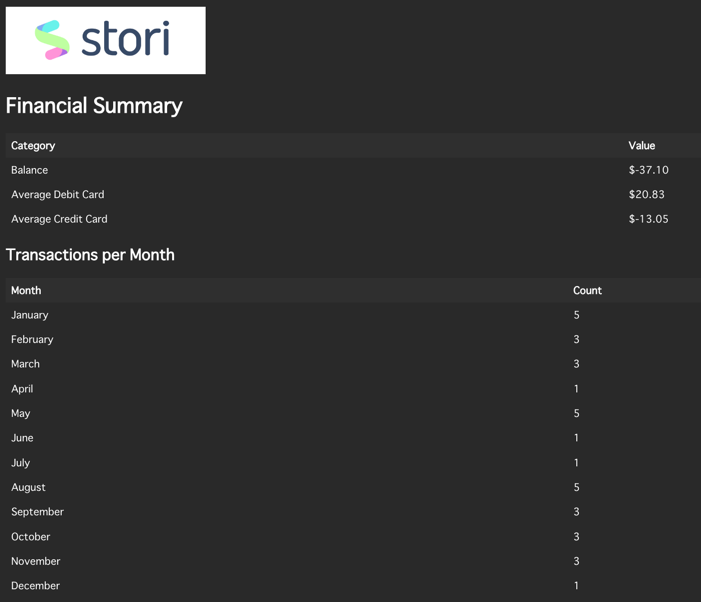

# Coding Challenge: Credit Cards Summary
(v1.0.0)

## Content
* [Description](#description)
* [Get Started](#get-started)
  * [Tools](#tools)
  * [Configuration](#configuration)
  * [Generate own CSV files](#generate-own-csv-files)
  * [Deployment](#deployment)
* [AWS Tools](#aws-tools)
  * [Amazon SES](#amazon-ses)
  * [Dynamo DB](#dynamo-db)
* [User Guide](#user-guide)
* [Main Structure](#main-structure)

## Description
This coding challenge involves developing a system that processes a file from a mounted directory. 
The file contains a list of debit and credit transactions associated with an account. 
The system is responsible for processing the file and sending a summary of the information to the user via email.

## Get Started

### Tools
* Docker
* AWS CLI
* IDE (Golang, VSCode, etc)

### Configuration
#### Environment variables in Dockerfile
```
ENV=
AWS_ACCESS_KEY_ID=
AWS_SECRET_ACCESS_KEY=
```
#### Environment variables in `.env` file
* Setup all environment variables in [environment](environment) package naming `{env_name}.env` Example:
```
LOG_LEVEL=
CSV_PATH=
EMAIL_SENDER=
AWS_REGION=
```
_Note: by default the application runs with local environment variables._

### Generate own CSV files
If you want to generate own CSV file, update the `count` (line 13) to set amount of file you want to create and add `EmailAddress` (line 70) of receiver (destination).

Example
```go
.
const count = 20
.
.
.
err = a.PostUser(provider.User{
		ID:           name,
		Name:         gofakeit.Name(),
		EmailAddress: "mock@mock.com",
	})
```
Then build the script
```bash
go build script/main.go
```
and run the script
```bash
./main
```
then you can see new archives in [to_process](resources/to_process) to system process.

### Deployment
1. Deploy the application
```bash
docker build -t rie-kaneko/credit-cards-summary .
````
2. Run the container
```bash
docker run -d --name credit-cards-summary rie-kaneko/credit-cards-summary
```
3. Verify the running container
```bash
docker ps
```

## AWS Tools
### Amazon SES
The mail will be sent by this tool, where you have a registered mail.
### Dynamo DB
There is a table called `users` where the following data is stored to be used in sending the mail.
```go
type User struct {
	ID           string `json:"id"`
	Name         string `json:"name"`
	EmailAddress string `json:"email_address"`
}
```
## User Guide
### File
Each user has two archives:
* archive that contains `debit` transactions
* archive that contains `credit` transactions

These files are structured as: `{user_id}_{debit|credit}.csv`

When the system runs, it checks if there are files in the [to_process](resources/to_process) folder to process and send the mail.
* In case it is processed, these files are moved to [processed](resources/processed).
* In case any error occurs in the process, the files are moved to [not_processed](resources/not_processed).

### Email


## Main Structure
```
rie-kaneko/credit-cards-summary/
├── config/
│   ├── env_variables.go
│   └── logs.go
├── environment/
│   └── handler.go
├── internal/
│   ├── provider/
│   │   ├── aws.go
│   │   └── db.go
│   └── service/
│   │   ├── const.go
│   │   ├── reader.go
│   │   ├── sender.go
│   │   └── service.go
├── resources/
│   ├── not_processed/
│   ├── processed/
│   └── to_process/
├── script/
│   └── main.go
├── main.go
├── go.mod
│   └── go.sum
├── Dockerfile
├── Makefile
├── .gitignore
└── README.md
```
* **config:** load all env variables saved in [environment](environment) when the app starts.
* **environment:** contains all env variables ver environment.
* **internal:** contains all logics of the system.
  * **provider:** logic to connect to external provider (in this case aws).
  * **service:** main logic of the system.
    * **service:** where the main call to start all functionality.
    * **reader:** contains logic to read files using goroutines.
    * **sender:** contains logic to send mail to each user.
* **resources:** contains archives csv to process.
* **scrip:** script to generate csv files and users in Dynamo DB.